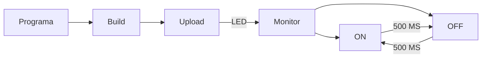
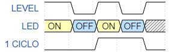

# PRÀCTICA 1
## CODIGO DEL PROGRAMA:

```
#include <Arduino.h>
#define LED 0

void setup() {
    Serial.begin(115200);
    pinMode(LED,OUTPUT);
}

void loop() {
    delay(500);
    Serial.println("ON");
    digitalWrite(LED,HIGH);
    delay(500);
    Serial.println("OFF");
    digitalWrite(LED,LOW);
}

```


## DIGRAMA DE FLUJOS:
Para realizar el diagrama de flujo hemos tenido que descargar la extensión de "mermaid".



## DIAGRAMA DE TIEMPOS:



